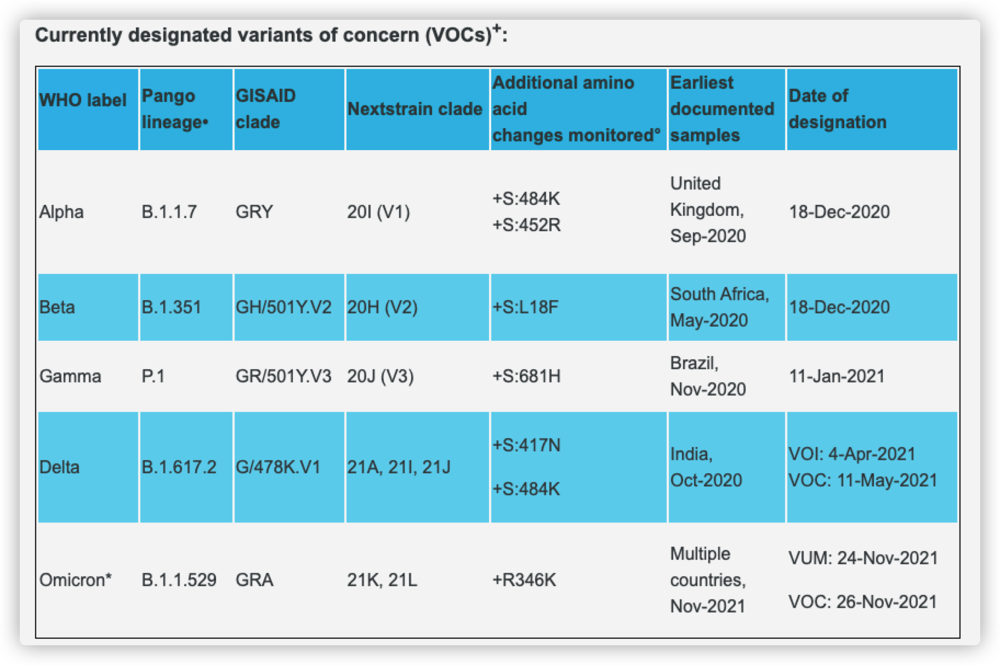
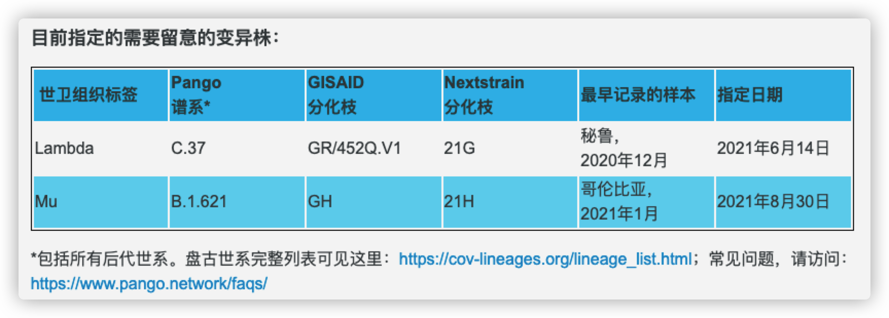

 
 <h1 align="center">Science</h2>
 
<b>知识这东西就要随时的核实和订正</b>

<!-- 顶部至此截止 -->

# 思维与方法

# 演化与认知

# 真相与因果

# 文化与体系

# 航空与航天

# 科学理论与思维

# 医学与健康

# 通信技术与操作系统

# 气候与能源

# 食品科学与工业

# 社会议题与思考

# COVID-19 新冠疫情

## 传言与事实

> 2021年 12月
>
> 来源：世界卫生组织
>
> https://www.who.int/zh/emergencies/diseases/novel-coronavirus-2019/advice-for-public/myth-busters

- 事实：维生素和矿物质补充剂不能治愈COVID-19

    维生素D和C以及锌等微量营养素对免疫系统的良好运作至关重要，在促进健康和良好营养状况方面发挥着关键作用。目前没有关于使用微量营养素补充剂治疗COVID-19的指导。

    

- 事实：研究表明羟氯喹在治疗 COVID-19 方面没有临床益处

    羟氯喹或氯喹是一种治疗疟疾、红斑狼疮和类风湿性关节炎的药物，关于能否将其作为COVID-19的一种可能治疗药物已经进行了研究。目前的数据显示，这种药物并不能降低COVID-19住院患者的死亡率，对中度疾病患者也无帮助*。对疟疾和自身免疫性疾病患者使用羟氯喹和氯喹一般是安全的，但在没有适应症和没有医疗监督的情况下使用羟氯喹，则会导致严重的副作用，应予避免。

    *需要进行更明确的研究，以评估其在轻度疾病患者中的价值，或在暴露于COVID-19的患者中作为接触前或接触后预防措施的价值。

    

- **地塞米松是用于所有 COVID-19 患者的治疗方法吗？**

    地塞米松应留给最有需要的患者使用，不应进行囤积。

    该药**对于轻症患者没有治疗改善作用**。**地塞米松是一种用于抗炎和免疫抑制的皮质类固醇**。对于需要使用呼吸机的某些COVID-19患者，每日用6mg地塞米松治疗10天可带来健康改善效果。

    

- 事实：人们在锻炼时不应戴口罩

    人们在锻炼时不应戴口罩。口罩会降低舒畅呼吸的能力。

    汗水会使口罩较快变湿，导致呼吸困难，并助长微生物生长。锻炼时应采取的重要预防措施是，与他人保持至少一米的身体距离。

    

- **事实：水或游泳不会传播 COVID-19 病毒 **

    COVID-19 病毒不会在游泳时通过水传播。然而，当有人与感染者密切接触时，病毒就会在人与人之间传播。

    

- **事实：大多数 COVID-19 患者都可康复**

    大多数 COVID-19 患者出现轻度或中度症状，通过支持性治疗就可以康复。

    

- 事实：在羹汤或其他食物中放辣椒并**不能**防治COVID-19

    食物中加辣椒虽很美味，但并不能防治COVID-19。保护自己免受新型冠状病毒侵害的最好方法是，与他人保持至少1米距离，并经常认真洗手。饮食均衡、补足水分、经常锻炼和良好睡眠也有益于维持身体健康。

    

- 事实：COVID-19 不会通过家蝇传播

    迄今为止，没有证据或信息表明COVID-19病毒通过家蝇传播。引起 COVID-19 的病毒主要通过感染者咳嗽、打喷嚏或说话时产生的飞沫传播。触摸受污染的表面后未洗手便触摸眼睛、鼻子或嘴，也可能导致感染。为了保护自己，与他人保持至少1米的距离，并对经常接触的表面进行消毒。还应经常彻底清洁双手，并避免触摸眼睛和口鼻。

- 事实：在身上喷洒漂白剂或其他消毒剂或摄入这类物质不能保护您免受 COVID-19 的侵害，反而可能造成危险

    在任何情况下都不要在身上喷洒漂白剂或任何其他消毒剂或摄入这类物质。摄入这些物质可能会中毒，喷洒会对皮肤和眼睛造成刺激和伤害。漂白剂和消毒剂只能用于物体表面消毒。应将漂白剂和其他消毒剂放在儿童接触不到的地方。

    

- 事实：喝甲醇、乙醇或漂白剂不能预防或治愈 COVID-19，却可能非常危险

    甲醇、乙醇和漂白剂是有毒物质，喝下去会导致残疾和死亡。甲醇、乙醇和漂白剂有时被用于清洁产品以杀死表面的病毒，但绝不能喝它们。它们不会杀死体内的病毒，却会伤害内脏。

    为了保护自己不感染 COVID-19，可对物体和表面进行消毒，尤其是那些经常接触的物体和表面。可以使用稀释的漂白剂或酒精。此外，应确保经常彻底清洁双手，并避免触摸眼睛和口鼻。

    

- 事实：晒太阳或在高于25摄氏度的温度下并不能预防 COVID-19

    无论阳光多充足，或天气多热，您都可能会染上 COVID-19。天气炎热国家也报告了 COVID-19 病例。为了保护自己，请务必经常认真洗手，而且不要触摸眼睛、嘴巴和鼻子。

    

- 事实：感染新型冠状病毒并不意味着您会终生携带此病毒

    大多数COVID-19患者都能痊愈，体内不再有此病毒。如果您罹患此病，一定要对症治疗。若有咳嗽、发烧和呼吸困难，应尽早就医，但请先打电话给医疗机构。在获得对症支持治疗后，大多数患者都能康复。

    

- 事实：能够屏住呼吸10秒或更长时间而不咳嗽或感到不适，并不意味着您没有患 COVID-19

    COVID-19最常见症状是干咳、乏力和发烧。有些人可能会患肺炎等较严重疾病。实验室检测是确认您是否患COVID-19的最好方法。不能用这种呼吸练习来测试，这样做甚至可能有危险。

    

- 事实：COVID-19病毒可以在气候炎热潮湿的地区传播

    从迄今得到的证据来看，COVID-19病毒可以在**所有地区**（包括气候炎热潮湿地区）传播。无论气候如何，如果你居住在或前往报告有COVID-19疫情的地区，务必采取保护措施。避免染上COVID-19的最好方式就是勤洗手。这样可以除去手上可能携带的病毒，而且可以避免随后因碰触眼睛、嘴和鼻子可能发生的感染。

    

- **事实：低温和冰雪不能杀死 COVID-19 病毒**

    没有理由认为寒冷天气可以杀死新型冠状病毒或其他疾病。不管外部气温或天气如何，正常体温保持在36.5和37左右。勤用含酒精成分的免洗洗手液或肥皂和清水洗手是保护自己避免感染2019冠状病毒病的最有效手段。

    

- **事实：洗热水澡并不能预防 COVID-19**

    洗热水澡不能预防 COVID-19。不管您洗澡或淋浴温度如何，您的正常体温仍会保持在36.5℃至37℃之间。事实上，洗热水澡时，如果水温过热是有害的，可能会烫伤您。勤洗手是防范 COVID-19 的最好方法，可以清除手上的病毒，避免因手触碰眼睛、嘴巴和鼻子而可能发生感染。

    

- **事实：新型冠状病毒不能通过蚊虫叮咬传播**

    迄今为止，没有任何信息或证据表明蚊子可能传播2019冠状病毒病。新型冠状病毒是呼吸道病毒，它主要通过接触已感染者咳嗽或打喷嚏时产生的呼吸道飞沫，或通过接触其唾液或鼻涕而传播。为保护自己，勤用含酒精成分的免洗洗手液或肥皂和清水洗手，并避免与咳嗽或打喷嚏者密切接触。

    

- **事实：干手器对杀死新型冠状病毒无效**

    无效。干手器不能有效杀死新型冠状病毒。为了防止自己感染新型冠状病毒，应该经常用含酒精成分的免洗洗手液或用肥皂和水洗手。将手清洗干净后，用纸巾彻底擦干或用暖风干手器彻底烘干。

    

- 事实：不应使用紫外线灯来消毒手或其他部位皮肤

    紫外线照射会刺激皮肤并损伤眼睛。用含酒精成分的免洗洗手液或用肥皂和水洗手是清除病毒的最有效方法。

    

- **事实：肺炎疫苗不能预防新型冠状病毒**

    不能。肺炎疫苗，如肺炎球菌疫苗和乙型流感嗜血杆菌疫苗，不能预防新型冠状病毒。

    这一病毒是新的和不同的病毒，需要有专门疫苗。在世卫组织支持下，研究人员正在努力开发新型冠状病毒疫苗。

    这些呼吸道疾病疫苗对预防新型冠状病毒虽无效果，但我们强烈建议接种这些疫苗，以维护健康。

    

- 事实：用生理盐水清洗鼻子不能预防 COVID-19

    没有证据表明，经常用生理盐水冲洗鼻子可以防止感染新型冠状病毒。

    有一些有限的证据表明，经常用生理盐水清洗鼻子可以帮助人们更快地从普通感冒中恢复过来。然而，经常清洗鼻子并不能预防呼吸道感染。

    

- 事实：吃大蒜不能预防 COVID-19

    大蒜是 一种健康食品，可能有一些抗菌特性。然而，从目前的疫情来看，没有证据表明食用大蒜可以保护人们免受新型冠状病毒的感染。

    

- 事实：所有年龄段的人都可能感染新型冠状病毒

    所有年龄段的人都可能受到新型冠状病毒的影响。年龄较大和患有哮喘、糖尿病、心脏病等疾病的人感染该病毒的可能性也许更大。

    世卫组织建议所有年龄段的人采取措施保护自己免受病毒感染，如保持手部清洁和呼吸道健康的卫生习惯。

    

- 事实：抗生素不能预防和治疗COVID-19

    抗生素对病毒无效，只对细菌有效。

    COVID-19由病毒引起，因此，不应将抗生素用作预防或治疗手段。

    然而，如果你因COVID-19住院，你可能会接受抗生素治疗，因为有可能同时感染细菌。

## 命名严重急性呼吸综合征冠状病毒2变异株

> 本文发布时间：2021年12月 19日
>
> 引用来源：世界卫生组织 https://www.who.int/zh/activities/tracking-SARS-CoV-2-variants/

由 [GISAID](https://www.gisaid.org/), [Nextstrain](https://nextstrain.org/) 和 [Pango](https://cov-lineages.org/) 建立的命名和跟踪严重急性呼吸综合征冠状病毒2遗传谱系的命名系统目前和将来都将被科学家和科学研究使用。为了方便公众讨论变异株，世卫组织召集了一组来自世卫组织病毒进化工作组、世卫组织COVID-19参考实验室网络的科学家、来自GISAID、Nextstrain、Pango的代表以及来自几个国家和机构的病毒学、微生物命名和沟通方面的其他专家，考虑为需要留意的变异株和需要关注的变异株提供易于发音和非污名化的标签。目前，世卫组织召集的这个专家组建议**用希腊字母作标签，即Alpha、Beta、Gamma**，这些标签对非科学受众讨论来说会更容易和更实用。

## 需要关注的变异株（VOC） 与 需要留意的变异株（VOI）

> 本文发布时间：2021年12月 19日
>
> 引用来源：世界卫生组织 https://www.who.int/zh/activities/tracking-SARS-CoV-2-variants/

鉴于严重急性呼吸综合征冠状病毒2不断演变以及我们对变异株影响的认识不断发展，这些工作定义可能会定期调整。必要时，经与世卫组织病毒进化工作组协商，不符合下列定义中概述的所有标准的变异株也可被指定为需要留意/关注的变异株，相对于其他循环变异株风险降低的变异株也会重新归类。

`VOC` - (Variants of concern) 需要**关注**的变异株

`VOI` - (Variants of interest) 需要**留意**的变异株

---

### 需要留意的变异株

**工作定义：**

一种严重急性呼吸综合征冠状病毒2变异株，符合需要留意的变异株定义(见下文)，通过比较评估，已被证明与下列一种或多种具有一定全球公共卫生意义的变化相关：

- 传播性增加或COVID-19流行病学方面的有害变化；或者
- 毒性增加或临床疾病表现的变化；或者
- 公共卫生和社会措施或可用的诊断工具、疫苗和治疗方法的有效性降低。

**目前指定的需要关注的变异株：**

***！注意此文章的发稿时间***

---

### 需要留意的变异株（VOI）

**工作定义：**

具有以下特征的严重急性呼吸综合征冠状病毒2变异株：

- 预测或已知会影响病毒特征的基因变化，例如可传播性、疾病严重程度、免疫逃逸、诊断或治疗逃逸；并且
- 确认导致多个国家出现重大社区传播或多个COVID-19聚集性病例，且相对流行率上升，病例数不断增加，或其他表明全球公共卫生正面临新风险的明显流行病学影响。

​	***！注意此文章的发稿时间***

## 病毒变异

> 本文发布时间：2021年9月
>
> 引用来源：
>
> ​	卓克·科技参考
>
> ​	世界卫生组织

根据英国巴斯大学和爱丁堡大学联合发表在《基因组生物学与进化》期刊上的。一周可能出现一次变异，但要注意这里说的“一次变异”，也就是一个碱基的改变，通常是**不**能导致一款新型号病毒出现的。具体发生多少碱基的改变才能算一个新型号病毒，这并没有统一的标准，还要在病例统计中寻找。比如，关键位置的蛋白质发生了改变，传播能力、致死率都发生了明显变化，才会被划分成一款新型号病毒。

当前，世界卫生组织把新冠病毒的变异分为了两大类：

一类叫作“**令人担忧的突变款**”，一共4种 - Alpha、Beta、Gamma、Delta

另一类叫作“**值得关注的突变款**”，一共6种 - Eta、Iota、Kappa、Lambda、Mu、Omicron

这篇研究的本意是说，对于基因序列的位点发生的变化，此前的研究存在偏差，把数值统计小了，而这次的研究更加全面。之所以说这次的研究更全面，就在于研究者把正向的突变和负向的突变全都考虑进来了，而此前的研究只考虑了正向突变。

**什么是正向突变和负向突变呢？**

**正向突变，指的是导致传播能力、致死率加强的那些突变**，也就是我们最关心的。而**负向突变，指的是导致感染能力、传播能力下降的那些突变**。由于这些负向突变发生后，逐渐就不在人群中传播了，于是就很容易被忽略，从而低估了病毒天然的变异速度。

## 植株

### 奥密克戎 - Omicron（B.1.1.529）

> 本文发布时间：2021年 12月
>
> 引用来源：世界卫生组织 
>
> https://www.who.int/zh/news/item/28-11-2021-update-on-omicron
>
> https://www.who.int/zh/news/item/26-11-2021-classification-of-omicron-(b.1.1.529)-sars-cov-2-variant-of-concern
>
> https://www.pango.network/faqs/

***！注意，此文章的发稿时间为 2021年11月 28日***

2021年11月26日，根据世卫组织[SARS-CoV-2病毒进化技术咨询小组](https://www.who.int/groups/technical-advisory-group-on-sars-cov-2-virus-evolution)（TAG-VE）的建议，世卫组织将B.1.1.529变异株命名为**奥密克戎（Omicron）**，并将其定为**需要关注的变异株**。世卫组织的这一决定基于该技术咨询小组获得的证据，并考虑到了奥密克戎的多种突变可能会对该病毒行为方式产生影响，例如可能会对其容易传播的程度或所致疾病的严重程度产生影响。以下是目前已知信息汇总摘要。

---

***！注意，此文章的发稿时间为 2021年 12月 19日***

**说明：**

2021年11月24日，南非首次向世卫组织报告了B.1.1.529变异株。这种变异株**有大量突变**，其中一些突变需要关注。初步证据表明，与其他需要关注的变异株相比，这种变异株的**再感染风险增加**。在南非几乎所有省份，这种变异株的病例数量似乎都在增加。目前的SARS-CoV-2聚合酶链反应诊断仍能发现这种变异株。几个实验室已经表明，在一种广泛使用的聚合酶链反应测试中，**三个靶基因中的一个没有被检测到（称为S基因缺失或S基因靶失败）**，因此，在进行基因测序之前，这种测试可以作为这种变异株的标记。**使用这种方法发现这种变异株的速度比以前感染激增的速度更快，这表明这种变异株可能具有增长优势。**

---

***！注意，此文章的发稿时间为 2021年11月 28日***

**目前对奥密克戎的认识**

南非以及世界各地研究人员正开展研究，以进一步多方面了解奥密克戎，并将继续分享研究结果。

**传播能力**：**目前尚不清楚**与德尔塔等其他变异株相比，奥密克戎是否传播能力更强（例如是否更易在人与人之间传播）。在受该变异株影响的南非多个地区，检测呈阳性人数增加。正在开展流行病学研究，以了解这一现象是由于奥密克戎造成的，还是其他因素造成的。

**疾病的严重程度**：**目前尚不清楚**与德尔塔等其他变异株的感染相比，感染奥密克戎是否会导致更严重疾病。初步数据表明，南非住院率在上升，但这也可能是感染总人数增加，而不是奥密克戎感染造成的。**目前并无信息表明奥密克戎相关症状不同于其他变异株引致的症状。**最初报告的感染病例发生在大学生中，而年轻人往往症状较轻。了解奥密克戎变异株的严重程度将需要数日至数周时间。COVID-19的所有变异株，包括在全球主要流行的德尔塔变体，都可导致严重疾病或死亡，特别是对最脆弱人群而言，因此预防仍是关键。

---

***！注意，此文章的发稿时间为 2021年11月 28日***

**SARS-CoV-2既往感染的免疫力有效性**

初步证据表明，与其他需要关注的变异株相比，奥密克戎再感染风险**可能较高**（也就是说曾患COVID-19的人可能较易再度感染奥密克戎），但这方面信息有限。将在未来数日或数周内提供这方面更多信息。

**疫苗的有效性**：世卫组织正与有关技术伙伴合作，了解这一变异株对包括疫苗在内的现有抗疫工具的潜在影响。疫苗对于减少重症和死亡以及对付目前主要流行的德尔塔变异株仍然至关重要。现有疫苗仍然能够有效预防重症和死亡。

**现有试剂的有效性**：对其他变异株的检测显示，**广泛使用的核酸检测仍能检出感染**，包括检出奥密克戎感染。目前正进行研究，以确定是否会对其他类型检测（例如快速抗原检测）有任何影响。

**当前治疗的有效性**：**皮质类固醇和IL6受体阻滞剂仍能有效处理COVID-19重症患者**。将评估其他治疗方法，查明在奥密克戎变异株中病毒发生变化的情况下，这些治疗方法是否仍然有效。

---

# 数学

## 数学模型

`数学模型` - 在数学模型中，我们用种种**数字或数字的特定结构来表示一些物理现实**，我们用数学运算和变换过程来表示事物的物理变化。比如说，你们数学中的每一道应用题，都是一个建立数学模型和求解数学模型的过程。在数学模型中，我们用一个个的数学结构来表示实际的物理结构，用数学运算表示实际的物理变化。

### 微分方程

`微分方程` - 知道**自变量**、**未知函数**及**函数的导数**（或微分）组成的关系式，得到的便是微分方程，通过求解微分方程求出未知函数。微分方程模型的特点是**反应客观现实世界中量与量的变化关系**，往往与时间有关，是一个**动态的系统**。**一个系统某一时刻状态变化率，（在边界条件确定的情况下）是由此时它的状态唯一确定的。**

`实值微分方程` - 自变量、未知函数均为**实值**的微分方程称为**实**值微分方程

`复值微分方程` - 未知函数**取复值**或**自变量及未知函数均取复值**时称为**复**值微分方程

`常微分方程 Обыкновенное дифференциальное уравнение` - 自变量只有**一个**的微分方程称为常微分方程

`偏微分方程 Дифференциальное уравнение в частных производных` - 自变量的个数为**两个或两个以上**的微分方程称为偏微分方程

`阶数` - 微分方程中出现的未知函数**最高阶倒数的阶数**称为微分方程的阶数

`通解` -  我们把含有n个独立的任意常数 c1, c2, c3 ..., cn 的解称为n阶方程的通解

`解对常数的独立性` - 解对常数的独立性是指，对φ及其n-1阶偏导数关于n个常数c1, c2, c3 ..., cn的雅阁比行列式不为0

`特解` - 我们把满足初值条件的解称为微分方程的特解

`积分曲线` - 一阶微分方程 dy/dx = f(x, y) 的解y = φ(x)表示Oxy平面上的一条曲线，称为微分方程的积分曲线

#### 追赶法 解微分方程

追赶法：Метод 

